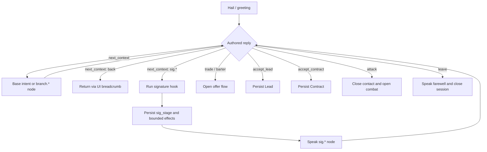

# Game-state interaction with alien dialogue

This document describes the current implementation, rather than proposing a new
dialogue design. It traces the authoritative game state that reaches
[`edge/dialogue`](../edge/dialogue/) and the state changes caused by speaking or
choosing a reply. The authored corpus contract remains
[`config/alien_dialogue_default.yaml`](../config/alien_dialogue_default.yaml), and the
design authority is [DESIGN §6.7](../docs/DESIGN.md#67-dialogue-and-conversation).

## Runtime boundary

`edge/dialogue` is a pure selection and rendering layer. It does not mutate
`UniverseState`. The core reducers assemble facts, call the dialogue layer, and persist
the consequences; the server projection performs the same assembly read-only so that it
shows the line and choices the reducer will resolve.

```text
UniverseState + GameConfig
        |
        +-- edge.dialogue.facts.contact_facts() -- selector fact map
        +-- context-specific planners ---------- placeholders and offer facts
        |
        v
species pack -> persona pack -> generic pack
        |
        v
matching DialogueLine -> authored choices -> rendered text
        |
        +-- server projection: no state change
        `-- core reducer: events + persisted Player/Encounter changes
```

The projection/reducer lockstep is implemented in
[`edge/dialogue/facts.py`](../edge/dialogue/facts.py),
[`edge/server/session.py`](../edge/server/session.py), and the alien-contact reducers in
[`edge/core/rules.py`](../edge/core/rules.py).

## State used to select a line

### Standing and identity

The selector derives a `standing` fact for every line and choice:

```text
AlienSpecies.base_disposition
  + Player.species_attitudes[AlienSpecies.roster_id]
  -> clamp to 0..1
  -> hostile | neutral | friendly

Player.alliance_id == AlienSpecies.alliance_id -> allied (overrides the band)
```

The hostility/amity thresholds come from `AliensConfig`. The species instance also
supplies its `id`, `roster_id`, `persona`, `name`, and alliance. These select the authored
pack, fallback persona, per-instance random stream, and the universal `{species}` and
`{alliance}` placeholders. `Player.name` supplies `{player}`.

Important current limits:

- `wary` is valid authored data but `standing_for()` never produces it.
- `DialogueWhen.treaty` is supported by the schema and selector, but live contact and
  combat calls currently use the default `treaty=False`. Treaty replies are disabled by
  the contact projection.
- `DialogueWhen.posture` and `.stage` are forward-compatible schema fields, but `_score()`
  rejects entries that set either. Current mechanic dialogue gates on
  `criteria.sig_stage` instead.
- A player grudge and negative `Player.alliance_standing` can make an encounter violent,
  and therefore cause combat dialogue to run, but neither is subtracted from the
  dialogue `standing`. A grudge normally also accompanies a reduced species-attitude
  offset, which *does* affect standing.

See [`edge/dialogue/select.py`](../edge/dialogue/select.py) and
[`edge/core/aliens.py`](../edge/core/aliens.py).

### `DialogueWhen.criteria` fact map

[`contact_facts()`](../edge/dialogue/facts.py) merges facts in this order; later layers
win on duplicate keys:

```text
situational -> callback -> cross-visit arc -> current contact session -> caller extras
```

| Layer | Fact | Authoritative state |
|---|---|---|
| Context extra | `has_intel_target` | Speaker disposition/alliance; `UniverseState.species_knowledge`; the roaming Entity's live position; discoveries, starbases, adjacency, distance/spatial maps; and the player's ship position, explored sectors, codex, and accepted leads. |
| Context extra | `has_contract_offer` | Contract configuration and species posture; effective disposition/alliance; existing player contracts; and live order books, ports, inter-species grudges, species positions, and eligible merchants. |
| Context extra | `subject` | The selected other species' `roster_id` for `dossier_other` and `branch.dossier_other.*`. The display name separately fills `{subject}`. |
| Session | `asked.<context>` | `Player.contact_session.facts`; set after that context is spoken during this visit. |
| Session | `traded` | Set when alien technology is bought or bartered during this visit. |
| Session | `accepted_lead` | Set when the player logs the speaker's coordinate tip during this visit. |
| Situation | `band` | Current ship sector's `distance_band`. |
| Situation | `in_nebula` | Phenomena/discoveries in the current sector. |
| Situation | `wreck_here` | A visible or detected, uncollected open-space wreck in the current sector. |
| Situation | `hull` | Current/max ship hull bucketed as `critical`, `scarred`, or `sound` using roster dialogue thresholds. |
| Situation | `low_turns` | `Player.turns_remaining` below the roster dialogue threshold. |
| Situation | `holds_empty`, `holds_full` | Current ship hold use and free capacity. |
| Situation | `carrying` | Commodity with the largest non-zero cargo stack; absent for an empty hold. |
| Situation | `just_fled_combat` | `Player.last_combat` is `fled` on `Game.day_number`. |
| Callback | `met_before` | Speaker kind is present in `Player.species_last_seen`. |
| Callback | `lead_pending`, `lead_followed` | A lead issued by this species kind points to an unexplored or explored sector. |
| Callback | `fled_us` | The most recent combat was a flight from this species kind. |
| Arc | `arc.<flag>` | Every value in `Player.species_arcs[speaker.roster_id]`. |
| Mechanic | `sig_stage` | Alias of the signature-mechanic stage stored in the same species arc map; also exposed as `arc.sig_stage`. |
| Combat | `round`, `pack_size`, `foes_left` | The active `Encounter` round and foe hull states. |
| Combat | `pack_bloodied`, `shields_down` | Whether at least half the pack is destroyed and whether encounter-local player shields are depleted. |

If the player has no resolvable ship or sector, situational facts are omitted. Combat
facts are added only for combat beats. Context extras are added only for their relevant
nodes.

### Other state that gates replies or selects a dialogue path

These values do not all become `DialogueWhen.criteria`, but they still affect which
dialogue is reachable or which authored replies are enabled:

| State/config | Effect |
|---|---|
| Species presence and the player's ship sector | A peaceful contact command requires the selected species instance to be in the same sector. |
| Entity flag, Entity position, and ship sensor rating | The singular Entity cannot be contacted below its sensor gate; first successful contact stamps its codex discovery. |
| `SpeciesConfig.trade_posture` plus `Player.species_arcs` posture override | Enables or disables the authored `trade` reply. Alliance membership opens `alliance_gated`; a reprogram mechanic can open `circuit_gated`. |
| Tech offers, effective disposition, latinum, artifacts, and free holds | Determine which trade/barter offers are available and whether the `barter` reply is enabled. |
| `SpeciesConfig.treaty_mode` | Provides the disabled-reply reason for treaty choices; the treaty state machine is not live. |
| Other met species | Enables the `dossier_other` reply and supplies its subject picker. “Met” for this menu is the presence of a species-kind key in `Player.species_attitudes`. |
| A live intel or contract offer | Enables `accept_lead` or `accept_contract`. Both are recomputed from state instead of trusting UI payloads. |
| Core sanctuary, species combatability/fleet, Entity status, escape-pod state, and `influence_gate` | `first_strike_block()` enables or disables the authored `attack` reply. |
| Encounter outcome, grudge severity, and alliance standing | Decide whether an encounter reaches greeting or automatic combat dialogue. |
| `Game.seed`, species instance, context, and recency ring | Seed deterministic line/grammar selection. The contact portrait uses a separate seed and is not dialogue selection. |

## Selection and realization

A `DialogueLine` has a `when`, a positive `weight`, an authored reply list, and exactly
one realization form:

- `variants`: choose one string while avoiding its recent indices;
- `grammar`: deterministically expand a Tracery `origin`, also rotated by recency.

Resolution is:

1. Walk `species.dialogue_pack -> species persona -> generic`.
2. Stop at the first pack with at least one matching entry for the context.
3. In that pack, choose the matching entry with the highest specificity. A pinned
   `standing` counts as two facts; treaty and each `criteria` key count as one.
4. Break equal-specificity ties by authored `weight` using deterministic RNG.
5. Render a fresh variant/grammar index and fill allowed placeholders.

The no-repeat ring is persisted at
`Player.dialogue_recency[("<roster_id>#<instance_id>", context)]`. It is per species
ship, not merely per species kind, so two ships do not share phrasing memory.

Choices use the winning line's authored list. If that line has no choices, the selector
uses the `generic` persona's choices for the same context. The shipped generic greeting
therefore provides the baseline menu, while any species, persona, branch, or mechanic
node can replace it.

## Dialogue types currently supported

The closed base-context vocabulary is defined in
[`edge/dialogue/intents.py`](../edge/dialogue/intents.py).

| Type | Contexts | How reached |
|---|---|---|
| Diplomacy | `greeting`, `treaty_offer`, `treaty_grant`, `treaty_condition`, `treaty_refuse`, `farewell` | Peaceful contact. Treaty nodes resolve text but their menu entry is currently disabled. |
| Trade | `trade_open`, `trade_refuse` | Authored trade/barter replies and the alien-tech reducers. |
| Discovery/intel | `offer_coordinates` | Authored reply; may expose and log a deterministic lead. |
| Contracts | `contract_offer`, `contract_report` | Authored reply; may book a deterministic deliver, destroy, or escort job. |
| Lore | `dossier_self`, `dossier_other` | Conversation about the speaker or another met species. |
| Encounter conversation | `refuel`, `extort_response`, `demand`, `reward` | Peaceful contexts available to authored flows or direct `Converse` commands. |
| Combat speech | `combat_open`, `betrayal`, `combat_taunt`, `surrender`, `flee_scorn` | Automatically selected by encounter reducers, never by ordinary `Converse`. |
| Authored branch | `branch.*` | Intermediate conversation nodes reached only through a choice. |
| Signature mechanic | `sig.*` | Choice target that runs the species hook, persists its stage/effects, then speaks. |

The shipped choice actions are `leave`, `trade`, `barter`, `accept_lead`,
`accept_contract`, and `attack`. A choice with no action is a pure transition. A choice
may also write arbitrary typed arc flags for later visits.

## Minimal branching model



Conversation position and the back-stack are not authoritative core state. Each
`Converse` command carries the displayed `context` and canonical `choice_index`; the
reducer rebuilds the same fact map and menu, validates the index, and applies the choice.
This keeps branching replayable without adding a current-node field to `Player`.

## State written by dialogue interactions

Peaceful speech can update:

- `Player.species_attitudes`: inserts the speaker kind at offset `0.0` when first met;
- `Player.species_last_seen`: records the speaker kind's current sector;
- `Player.dialogue_recency`: advances the spoken instance/context ring;
- `Player.contact_session`: opens/continues the visit and records `asked.<context>`;
- the Entity codex row and experience on first valid Entity contact.

Choice actions can additionally update:

- `Player.species_arcs` from an authored `arc` map or a signature mechanic stage;
- leads, contracts, alien-tech purchases, artifacts/cargo/latinum, attitude, alignment,
  experience, grudges, and mechanic-specific posture overrides;
- `Player.active_encounter` when the player attacks.

Buying or bartering alien technology records `traded` in the current contact session;
logging a lead records `accepted_lead`. `farewell` clears the session. Movement and the
start of a hostile encounter also clear it, so visit-local facts cannot leak across
contacts. Switching to a different species instance creates a fresh session.

Combat speech is intentionally narrower: it advances only the relevant dialogue-recency
ring and writes the `AlienSpoke` event. It does not open a contact session or mark a species
met/last-seen.

Signature hooks receive the full `Player`, species instance, species config, prior stage,
params, and the reply-derived approach. In the current reducer, the persisted
`sig_stage` selects the immediately rendered mechanic response. Although
`MechanicResult` also contains transient `facts`, `_resolve_mechanic()` does not currently
pass those facts into dialogue selection; authors should gate live mechanic responses on
`sig_stage`/`arc.sig_stage`.

## Determinism and persistence

Both projection and reducer seed dialogue with:

```text
Game.seed | species instance key | context | existing recency ring
```

The reducer selects using the pre-utterance state and then advances the ring. The
read-only projection uses that same pre-utterance state, so displayed speech, choices,
and executed choice indices remain in lockstep. Recency, contact-session facts, arc
flags, leads, contracts, last combat, and all mechanical consequences are persisted and
included in replay/state hashing where they affect future behavior.
