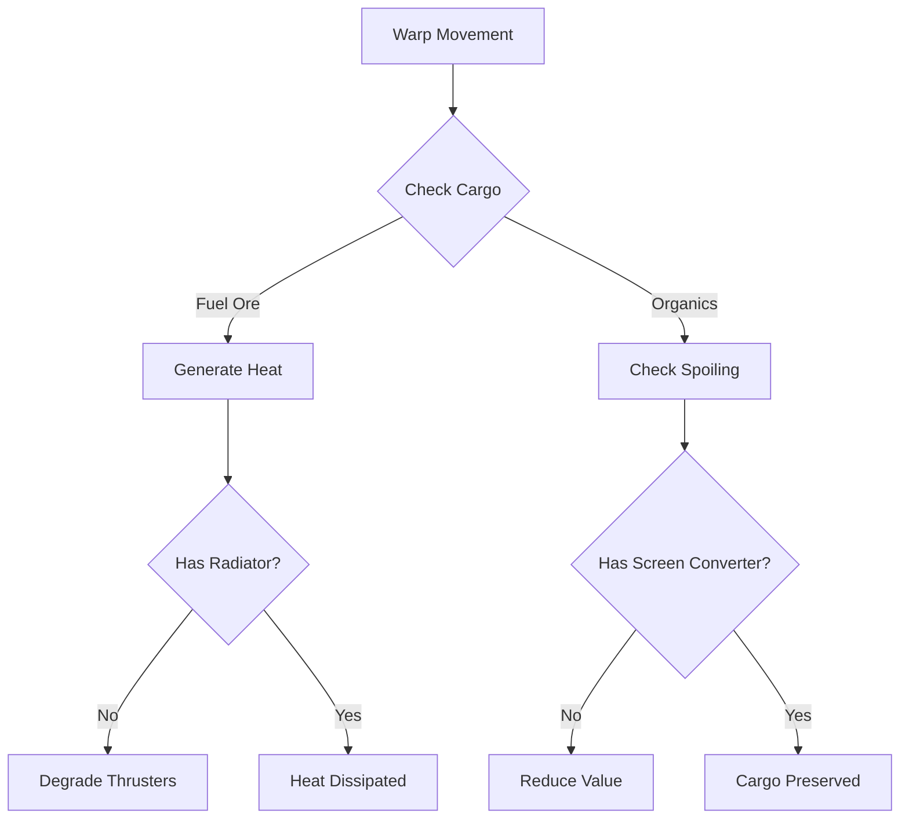

# Trading Enjoyability Plan 03 — The Interactive & Environmental Trade Plan

Status: proposed (competes with `docs/TRADING_ENJOYABILITY_PLAN.md` and `docs/TRADING_ENJOYABILITY_PLAN_02.md`)  
Scope: make trade an active, physical, and integrated gameplay system that directly feeds into the ship-upgrades and navigation loops

## 1. Where this plan disagrees

- **Plan 01 (Travelogue)** treats trading monotony as a **presentation problem**. It assumes players are bored because the ports lack flavor, and proposes static lore, text logs, and collectibles. While beautiful, this content is consumed once and then skipped; it does not change the fact that player inputs are simple menu repetitions.
- **Plan 02 (Dynamic Market)** treats trading monotony as an **arbitrage problem**. It proposes making the numbers more visible (price tapes, slippage) and volatile (hinterland events, spread decay), plus automation (haulers). This is mathematically elegant but keeps trade abstract: it is still a game of spreadsheets, graphs, and menus, eventually automated away so the player can play the "real" game.

The premise of this plan:

> **Trading is monotonous because it is physically passive and disconnected from the core game loops. A trade run should feel like a physical voyage through space—where cargo has mass and hazards, navigation requires active path decisions, and ship subsystems directly affect your hauling capability.**

Currently, a player ship's slotted subsystems (Spindrive, Thrusters, Screens, Main Gun) and component tiers (I–III) are built for combat and exploration, while trading is just a way to generate latinum. This plan closes that loop: **what you haul affects how your ship flies, and how your ship is configured affects how safely and efficiently you can haul.**

This preserves all underlying Phase 1–3 invariants: the three commodities, the live order book, hard purses, pure deterministic replay, and fast menu inputs for efficient players. It simply makes the flight between those menus mechanically alive.

---

## 2. The invisible synergy (the core opportunity)

The game already possesses complex systems that are currently siloed from trade:

| Existing System | Current Use | Latent Trade Synergy |
|---|---|---|
| **Subsystem Components** (`radiator`, `converter`, `linkage`) | Combat and speed calculations only | **Cargo stabilization**: protecting fragile or volatile loads from spoiling or exploding during warp. |
| **Warp Navigation** (turns-per-warp, fuel, connectivity) | Abstract movement cost | **Cargo mass physics**: heavy cargo increases turn costs, drains fuel, and slows combat escape. |
| **Sector Discoveries** (nebulae, solar flares, anomalies) | Passive stamps and lore | **Environmental route hazards**: flight paths that damage shields, disable sensors, or require specific ship aspects to survive. |
| **Alien Signature Mechanics** (literalist, escalating-demand) | Combat/Encounter dialogue triggers | **Haggle personality profiles**: alien species negotiating prices using their innate behavioral traits. |

By linking these existing pieces, we don't need to write a massive new engine. We just need to build bridges between `edge/core/economy.py`, `edge/core/models.py`, and `edge/core/navigation.py`.

---

## 3. The idea ladder

Ordered from low to high impact. Each tier is structurally independent.

### Tier 0 — Tactical Friction & Physicality (Very low effort)

**0.1 Cargo Mass Dynamics**  
Occupied holds (trade cargo + loose components) add mass to the ship hull.
*   **Agility Penalty**: High mass reduces `combat_speed` (evasion) and makes escaping encounters harder (lowers the 10% escape floor).
*   **Warp Drag**: Every 100 units of cargo increases warp cost by a fractional turn or consumes extra fuel ore, unless the player has upgraded thrusters (`thrusters` subsystem with active `accelerator` or `burner` components).
*   *Decision:* Do I fill the holds to 100% and crawl through space vulnerable to interception, or do I run half-full to stay nimble?

**0.2 Sector Hazard Overlays**  
Surface sector anomalies on the sector and warp navigation list. 
*   If Sector 12 contains a `nebula` or `solar_flare` (known discoveries), render a small warning tag: `Sector 12 [Nebula: Cloak Off]`. 
*   This instantly turns route-planning into a visual navigation game rather than checking numbers.

**0.3 Personality-Driven Haggling**  
Replace the flat probability roll in haggling with species-specific negotiation behaviors:
*   *Literalist species*: Offended by counter-offers. A single insulting bid immediately exits negotiations, forcing you to accept their default price or walk.
*   *Escalating-demand species*: Every rejected offer causes their price to move *against* you on subsequent rounds, adding urgency.
*   *Trojan-gift species*: Might accept an extremely low buy offer, but secretly attach a broken component or limpet mine to your hull.

---

### Tier 1 — Active Cargo & Environmental Routing (Medium effort)

**1.1 Reactive Cargo (Commodity Physics)**  
Give the three commodities distinct physical behaviors in transit, turning holds from silent containers into active cargo:
*   **Volatile Fuel Ore**: Generates heat. Warping too quickly (consecutive warps without resting) degrades components in the `spindrive` or `thrusters` unless the player has `radiator` or `linkage` components installed.
*   **Spoiling Organics**: Perishes over turns. Organics lose 3% value per warp-hop, accelerated when transiting sectors near hot planets, unless preserved by screen power (`screens` subsystem with active `converter` components).
*   **EMP-Leaking Equipment**: Slowly leaks electromagnetic interference, temporarily reducing `sensor_rating` and `cloak_rating` while carried.
*   *Decision:* Traders must customize their engine room layout. A ship built to carry Organics needs strong converter screens; a Fuel Ore carrier needs advanced radiators.

**1.2 Connection-Based Flight Hazards**  
Warp links are not empty lanes. Introduce environmental obstacles:
*   *Nebula lane*: Drains shield strength (`screens`) on transition.
*   *Solar storm connection*: Scrambles navigation, hiding the map display of neighboring sectors for 3 turns.
*   *Asteroid belt warp*: Damaging to ship hulls unless pilot has high `combat_speed` or laser turrets.
*   *Decision:* The Computer's route planner gains toggles: `Avoid Nebulae` or `Avoid Storms`. The player actively chooses between the short, hazardous route or the long, safe bypass.

---

### Tier 2 — Wilderness Commerce & Triangulation (Medium-to-high effort)

**2.1 Deep Space Caravan Barter**  
Wandering NPC merchant caravans roam the warp lanes.
*   The player can intercept these caravans in open space.
*   Offers spontaneous, direct barter: sell cargo at a premium or trade recovered artifacts directly for rare components without returning to Stardock.
*   This breaks the binary loop of "Port A to Port B" by inserting dynamic trade nodes right on the flight path.

**2.2 Supply Chain Loops (Industrial Triangulation)**  
Instead of simple pairs, connect ports in natural industrial chains:
*   *Refinery Port* buys Fuel Ore and sells Equipment.
*   *Research Station* buys Equipment and sells Organics.
*   *Agricultural Ring* buys Organics and sells Fuel Ore.
*   Rather than pair-trading, the player runs a 3-way route. Completing a full cycle boosts local reputation, awards a standing bonus with the sector's alliance, and yields high profit margins.

---

### Tier 3 — Blockades, Smuggling, and Sabotage (High effort)

**3.1 Smuggling & Contraband Operations**  
Alliances declare specific cargo as contraband (e.g., rival military-grade Equipment or bio-hazardous Organics).
*   Carrying contraband through alliance patrol sectors triggers inspection hails.
*   The player must use cloaks (`cloak_rating`), bypass patrols via hidden wormholes, or bribe officers.
*   Smuggled goods sell for massive premiums at black markets, but getting caught tanks alliance standing and turns the Core Space governor hostile.

**3.2 Economic Sabotage and Sector Disruption**  
Allow traders to deploy equipment to actively manipulate local markets:
*   *EMP Probe*: Deploy in a sector to temporarily disable a port's order book or freeze their stock regeneration.
*   *Blockade Mines*: Deploy sector fighters in "Toll" or "Offensive" mode to block NPC traders from delivering goods, creating a temporary artificial shortage and driving up sell prices.

---

## 4. Proposed delivery milestones

A three-phase execution plan that gradually introduces physical systems:

### Milestone A — "Hauling Mass and Hazards" (Tier 0.1 + 0.2 + 1.2)
Implement cargo weight mechanics, warp turn modifiers, and basic sector/warp connection hazards.
*   *Exit Criterion:* A player carrying 300 units of Fuel Ore consumes more turns per warp, has lower evasion in encounters, and must actively path around a shield-draining nebula sector.

### Milestone B — "Reactive Cargo & Specialty Outfitting" (Tier 1.1 + 0.3)
Introduce reactive commodity physics (heat generation, spoilage, EMP leakage) and connect them to engine-room components. Map species negotiation styles to haggling.
*   *Exit Criterion:* To successfully haul high-value Organics across the hot frontier without loss, the player must slot a Tier-II Converter into their Screens subsystem.

### Milestone C — "Contraband & Caravans" (Tier 2.1 + 3.1)
Implement wandering caravan encounters, alliance contraband bans, patrol inspections, and smuggling black markets.
*   *Exit Criterion:* The player cloaks their cargo hold to sneak illegal bio-implants past Federation patrols, selling them at a dark port for triple profit.

---

## 5. Layer boundaries & code architecture

-   **Determinism**: All cargo spoilage rates, heat accumulation, and connection hazards are calculated deterministically from `(seed, current_turn, sector_id)`. No runtime random numbers are drawn during state projection.
-   **`edge/core`**: 
    *   `Ship` properties (`combat_speed`, `turns_per_warp`) are updated to read cargo mass.
    *   `execute_trade` and move reducers check for reactive cargo states (e.g. applying heat damage to subsystems or reducing organic value).
    *   No Textual or GUI elements are imported; state updates remain pure.
-   **`edge/server`**:
    *   Projects the resolved hazard tags for visible sectors.
    *   Applies contraband checks on movement commands entering patrol sectors.
-   **`edge/tui`**:
    *   Renders hazard indicators next to sectors in the warp list.
    *   Renders warning bars in the cargo hold screen (e.g. "Fuel Ore Heat: 45%", "Organics Freshness: 82%").

---

## 6. Tests and verification

-   **Replay Integrity**: A fixed seed and command log must reproduce identical cargo decay, subsystem heat damage, and caravan encounters.
-   **Conservation Invariant**: Spoiled Organics or exploded Fuel Ore must correctly reduce ship cargo quantities without affecting port purses or minting illegal latinum.
-   **Performance Check**: Adding cargo weight/mass calculations must not delay the pathfinder/route-planner in the TUI (keep path computation under 5ms).
-   **UI Safety**: All hazard and warning meters must fit in 80×24 layouts, collapsing cleanly if screen space is constrained.

---

## 7. The three-way comparison

| Aspect | Plan 01 (Travelogue) | Plan 02 (Dynamic Market) | Plan 03 (Interactive Physicality) |
|---|---|---|---|
| **Core Diagnosis** | Ports are anonymous | The loop has no decisions | Hauling is physically passive and decoupled from the ship |
| **Primary Fix** | Authored narrative lore | Price tapes, events, & automation | Cargo mass, reactive commodities, & hazards |
| **Effort / Risk** | Content-heavy, rules-light | Rules-heavy, balance risk | Rules-medium, system-integration focus |
| **Upgrade Loop Impact** | Pins targets; minor visual rewards | Funds upgrades faster via optimization | **Creates a new demand** for upgrades (specializing holds) |
| **Pacing / Rhythm** | Staged story reveals | Repositioning due to price swings | Actively dodging hazards & managing ship |
| **Pillar Alignment** | Exploration (discovering lore) | Economy (pure arbitrage simulation) | **Survival & Physics** (piloting, ship tuning) |

## 8. Recommendation

We recommend **Milestone A and B of Plan 03** as the primary focus, combined with **Plan 02's Legibility tools (Tier 0 price tape)**. 

By adding physical mass to cargo and linking commodity behaviors directly to the engine room subsystems, we turn the upgrade loop into a double-ended reward: players upgrade their ship to explore farther *and* to carry more volatile, high-value payloads. This turns trading from a tedious chore into a strategic flight-prep and navigation puzzle.
